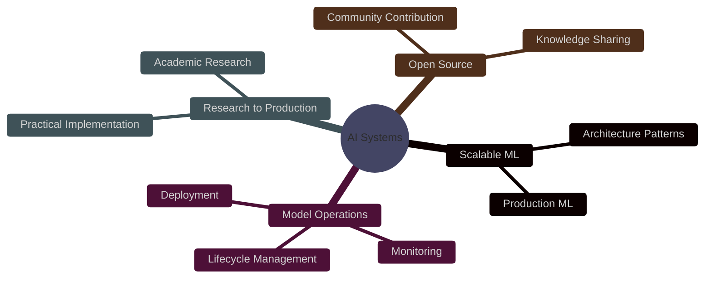

<div align="center">


<br>

[](https://www.linkedin.com/in/ganapriyahs/)
[](https://github.com/ganapriyahs)
[](mailto:ganapriyahs@gmail.com)

<br>


</div>

<br>

##  Professional Summary

Master's student in **Data Analytics Engineering** at Northeastern University with expertise in building end-to-end machine learning systems. Focused on developing scalable, production-ready AI solutions that bridge the gap between research and real-world deployment.

**Core Expertise:** `Machine Learning Systems` • `Deep Learning` • `Natural Language Processing` • `MLOps` • `Cloud Infrastructure`

<br>

##  Technical Expertise

<table>
<tr>
<td width="50%" valign="top">

### 💻 Programming & Data Science
```yaml
Languages:
  - Python
  - R
  - SQL
  - Bash
```

### 🤖 Machine Learning & AI
```yaml
Frameworks:
  - TensorFlow
  - PyTorch
  - Scikit-learn
  - Keras
  - Hugging Face Transformers
```

### ⚙️ MLOps & Infrastructure
```yaml
Tools:
  - Docker
  - Kubernetes
  - MLflow
  - Apache Airflow
  - Git
  - CI/CD Pipelines
```

</td>
<td width="50%" valign="top">

### ☁️ Cloud Platforms
```yaml
Providers:
  - Amazon Web Services (AWS)
  - Google Cloud Platform (GCP)
  - Microsoft Azure
```

### 🗄️ Data Engineering
```yaml
Technologies:
  - ETL Pipelines
  - Data Warehousing
  - PostgreSQL
  - MongoDB
  - Apache Spark
```

### 📊 Specializations
```yaml
Focus Areas:
  - Deep Learning Architecture
  - NLP & LLMs
  - Real-time Inference
  - Model Optimization
```

</td>
</tr>
</table>

<br>

##  Current Focus

<details open>
<summary><b>🔬 Research & Development</b></summary>
<br>

- 🏗️ Designing and implementing **scalable MLOps architectures** for production environments
- 🤖 Developing **LLM-based intelligent agents** with practical applications
- 📈 Building **robust model monitoring** and evaluation frameworks
- 🔍 Exploring advanced techniques in **model drift detection** and mitigation

</details>

<details open>
<summary><b>🎯 Areas of Interest</b></summary>
<br>

```diff
+ Production ML Systems at Scale
+ Large Language Model Applications
+ Real-time Model Serving & Monitoring
+ Automated Machine Learning Pipelines
```

</details>

<br>

##  Professional Philosophy

<div align="center">

| 🛡️ **Robust** | 📈 **Scalable** | 🔧 **Maintainable** | 🎯 **Impactful** |
|:---:|:---:|:---:|:---:|
| Resilient to edge cases and production challenges | Designed to handle growth from day one | Clear, documented, and easy to iterate on | Solving meaningful problems with measurable outcomes |

</div>

<br>

##  GitHub Statistics

<div align="center">


</div>

<br>

##  Featured Work

<div align="center">

### 🚀 Machine Learning Projects

</div>

<table>
<tr>
<td width="33%" align="center">

**🔄 End-to-End ML Pipelines**

Designed and deployed production-ready machine learning systems with automated training, evaluation, and deployment workflows.

</td>
<td width="33%" align="center">

**💬 NLP Applications**

Built NLP solutions for text classification, sentiment analysis, and information extraction using state-of-the-art transformer models.

</td>
<td width="33%" align="center">

**🔧 MLOps Infrastructure**

Implemented comprehensive MLOps practices including model versioning, experiment tracking, and automated monitoring.

</td>
</tr>
</table>

<div align="center">

*📂 Visit my repositories for detailed project documentation and code samples*

</div>

<br>

##  Education & Continuous Learning


**🎓 Master of Science in Data Analytics Engineering**  
Northeastern University, Boston, MA

<br>

**📚 Ongoing Learning**
- Advanced ML system design patterns
- Large language model fine-tuning and deployment
- Distributed computing for machine learning
- Production-grade software engineering practices

<br clear="right"/>

<br>

##  Professional Interests

<div align="center">



</div>

<br>

##  Let's Connect

<div align="center">

I'm interested in collaborating on innovative ML projects, discussing emerging technologies in AI, or exploring opportunities in data science and machine learning engineering.

<br>

[](https://www.linkedin.com/in/ganapriyahs/)
[](https://github.com/ganapriyahs)
[](mailto:ganapriyahs@gmail.com)

<br>

### 💭 *Building intelligent systems that make a difference*

<br>


</div>

<br>


</div>
