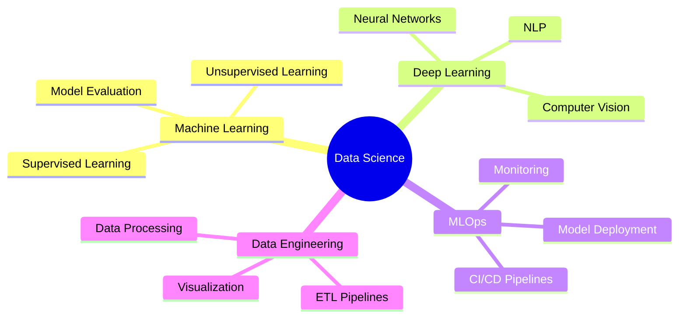

<div align="center">

# 👋 Hey there, I'm Ganapriya!

### Data Scientist | ML Engineer | AI Enthusiast

[](https://www.linkedin.com/in/ganapriyahs/)
[](https://github.com/ganapriyahs)
[](mailto:your.email@example.com)

</div>

---

## 🚀 About Me

> Transforming data into intelligent solutions

I'm a **Master's student in Data Analytics Engineering** at Northeastern University, passionate about building production-ready AI systems that solve real-world problems. My expertise lies in bridging the gap between cutting-edge ML research and scalable, deployed solutions.

```python
class Ganapriya:
    def __init__(self):
        self.location = "Boston, MA"
        self.education = "MS in Data Analytics Engineering @ Northeastern"
        self.interests = ["Machine Learning", "MLOps", "NLP", "Cloud AI"]
        self.currently_learning = ["LLM Agents", "ML System Design", "Advanced NLP"]
        self.goal = "Build impactful AI systems at scale"
    
    def say_hi(self):
        print("Let's build something amazing together!")
```

---

## 💻 Tech Stack

### Languages & Core Tools


### ML/DL Frameworks


### MLOps & DevOps


### Cloud Platforms


---

## 🎯 Current Focus

<table>
<tr>
<td width="50%">

### 🔨 Building
- Scalable MLOps pipelines for production ML
- LLM-based intelligent agents
- Advanced NLP workflows and applications
- Real-time model monitoring systems

</td>
<td width="50%">

### 📚 Learning
- Large Language Model fine-tuning
- ML system design patterns
- Distributed training strategies
- Model drift detection & mitigation

</td>
</tr>
</table>

---

## 📊 GitHub Analytics

<div align="center">
  
  
</div>

<div align="center">
  
</div>

---

## 🏆 Highlighted Projects

<!-- Add your best projects here -->
Coming soon! Check my repositories for exciting ML and AI projects.

---

## 📈 Expertise Areas



---

## 💡 What Drives Me

> "The best way to predict the future is to create it." - Peter Drucker

I believe in building AI systems that are not just accurate, but also:
- **Scalable** - Ready for production workloads
- **Reliable** - Monitored and maintained
- **Ethical** - Fair and transparent
- **Impactful** - Solving real problems

---

## 🤝 Let's Connect!

I'm always interested in collaborating on exciting ML/AI projects or discussing new ideas in the field.

<div align="center">

[](https://www.linkedin.com/in/ganapriyahs/)
[](https://github.com/ganapriyahs)

**Always learning. Always building. Always shipping.**

</div>

---

<div align="center">
  
</div>
