<div align="center">


<br/>

[](https://www.linkedin.com/in/ganapriyahs/)
[](https://github.com/ganapriyahs)


</div>

---


### 🚀 About Me

```typescript
const ganapriya = {
    location: "Boston, MA 🌆",
    education: "MS Data Analytics Engineering @ Northeastern",
    role: "Data Scientist | ML Engineer",
    code: ["Python", "R", "SQL", "Bash"],
    technologies: {
        ml: ["TensorFlow", "PyTorch", "Scikit-learn"],
        mlops: ["Docker", "MLflow", "Airflow", "Kubernetes"],
        cloud: ["AWS", "GCP", "Azure"],
        databases: ["PostgreSQL", "MongoDB", "Redis"]
    },
    currentFocus: "Building production-ready AI systems",
    funFact: "I debug AI models and my coffee addiction equally"
};
```

<br clear="right"/>

---

## 🛠️ Tech Arsenal

<details open>
<summary><b>💻 Languages</b></summary>
<br>


</details>

<details open>
<summary><b>🤖 ML/DL Frameworks</b></summary>
<br>


</details>

<details open>
<summary><b>⚙️ MLOps & DevOps</b></summary>
<br>


</details>

<details open>
<summary><b>☁️ Cloud & Infrastructure</b></summary>
<br>


</details>

---

## 🎯 What I'm Up To

<table>
<tr>
<td valign="top" width="50%">

### 🔥 Currently Building
  
- 🤖 **Scalable MLOps Pipelines**  
  Production-ready ML systems with monitoring

- 🧠 **LLM-Based Agents**  
  Intelligent automation workflows

- 📊 **Real-time Analytics**  
  ML model monitoring & drift detection

- 🚀 **End-to-End ML Projects**  
  From data to deployment

</td>
<td valign="top" width="50%">

### 📚 Currently Learning

- 🔬 **Advanced NLP**  
  Transformer architectures & fine-tuning

- 🏗️ **ML System Design**  
  Scalable architecture patterns

- ⚡ **Distributed Training**  
  Multi-GPU & cluster computing

- 🎨 **Generative AI**  
  Diffusion models & LLMs

</td>
</tr>
</table>

---

## 📊 GitHub Analytics

<div align="center">
  


</div>

---

## 🏆 Featured Projects

<div align="center">

<a href="https://github.com/ganapriyahs/project1">
  
</a>

<a href="https://github.com/ganapriyahs/project2">
  
</a>

</div>

<p align="center">
  <i>⭐ More amazing projects in my repositories! ⭐</i>
</p>

---

## 💼 Experience Highlights

```mermaid
%%{init: {'theme':'dark'}}%%
graph LR
    A[Data Collection] --> B[Data Processing]
    B --> C[Feature Engineering]
    C --> D[Model Training]
    D --> E[Model Evaluation]
    E --> F[Model Deployment]
    F --> G[Monitoring & Maintenance]
    G --> A
    
    style A fill:#58A6FF,stroke:#1F6FEB,stroke-width:2px,color:#000
    style B fill:#58A6FF,stroke:#1F6FEB,stroke-width:2px,color:#000
    style C fill:#58A6FF,stroke:#1F6FEB,stroke-width:2px,color:#000
    style D fill:#58A6FF,stroke:#1F6FEB,stroke-width:2px,color:#000
    style E fill:#58A6FF,stroke:#1F6FEB,stroke-width:2px,color:#000
    style F fill:#58A6FF,stroke:#1F6FEB,stroke-width:2px,color:#000
    style G fill:#58A6FF,stroke:#1F6FEB,stroke-width:2px,color:#000
```



---

## 🎓 Core Competencies

<div align="center">

| Domain | Skills |
|--------|--------|
| **Machine Learning** | Supervised & Unsupervised Learning, Feature Engineering, Model Selection |
| **Deep Learning** | CNNs, RNNs, Transformers, GANs, Transfer Learning |
| **NLP** | Text Classification, NER, Sentiment Analysis, LLMs, RAG Systems |
| **MLOps** | Model Deployment, CI/CD, Monitoring, A/B Testing, Model Versioning |
| **Data Engineering** | ETL Pipelines, Data Warehousing, Stream Processing, Data Quality |
| **Cloud Computing** | AWS SageMaker, GCP Vertex AI, Azure ML, Serverless Architectures |

</div>

---

## 🌟 Philosophy

<div align="center">

> *"Building AI systems that don't just work in notebooks,*  
> *but scale in production and deliver real impact."*

</div>

<table align="center">
<tr>
<td align="center" width="25%">

<br><b>Scalable</b>
<br><sub>Production-ready systems</sub>
</td>
<td align="center" width="25%">

<br><b>Reliable</b>
<br><sub>Monitored & maintained</sub>
</td>
<td align="center" width="25%">

<br><b>Ethical</b>
<br><sub>Fair & transparent</sub>
</td>
<td align="center" width="25%">

<br><b>Impactful</b>
<br><sub>Solving real problems</sub>
</td>
</tr>
</table>

---

## 📬 Let's Connect & Collaborate!

<div align="center">

I'm always excited to discuss ML/AI projects, collaborate on innovative ideas, or chat about the latest in tech!

<br>

[](https://www.linkedin.com/in/ganapriyahs/)
[](https://github.com/ganapriyahs)
[](mailto:ganapriyahs.com)

<br>


<br>


</div>

---


</div>
